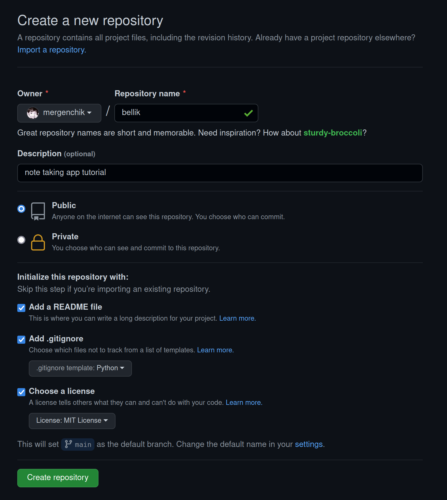
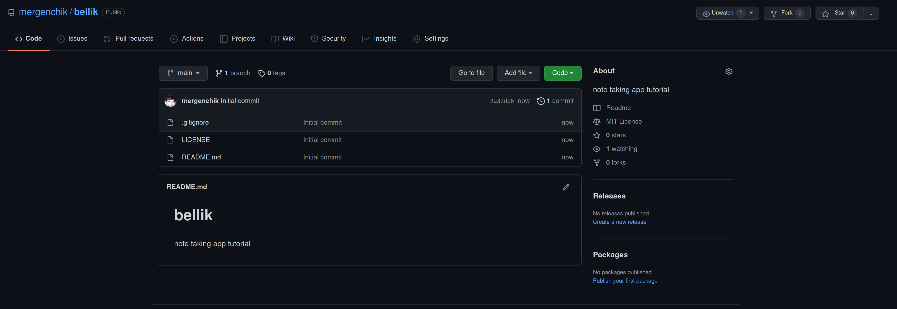
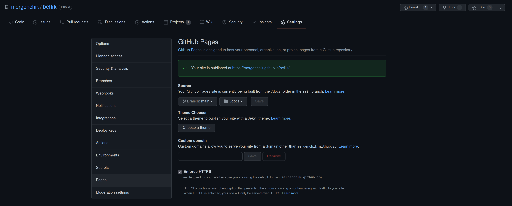

Small manual to start your repository on GitHub for your project. First we create a repository in GitHub. If you do not have account please create one.

As a developer, it is recommended to have GitHub account, so that you can contribute some code to community. Also, some companies prefer developers who have GitHub account and contribute to open source. Treat your github profile as your CV. Please select your github username vicely. Also, it will be very good if you have the same email as your github username. Selecting avatar is also preferred. 

## Note on GitHub account


## Repository setup

You can go to your github account, and press a plus sign on right top, near your profile picture or directly go to [https://github.com/new](https://github.com/new).



Provide repository name, select if it is private or public. If you want there are ready templates for .gitignore files, select accoridng your project. Also, if you are developing open source project, you can select from existing licenses.

After repository created, you will have screen as below.



You can clone that repository to your local machine to start developing.

For this project command to clone repository is

```
git clone git@github.com:mergenchik/bellik.git
```

please note that, you should have your SSH keys setup in your github profile.

## Pages Setup

The most important part of any software is documentation. Keeping documentation up to date is very difficult task.

GitHub provides Pages. You can point directory in your repository, so github automatically will build it and publish as GitHub Pages for that repository.


